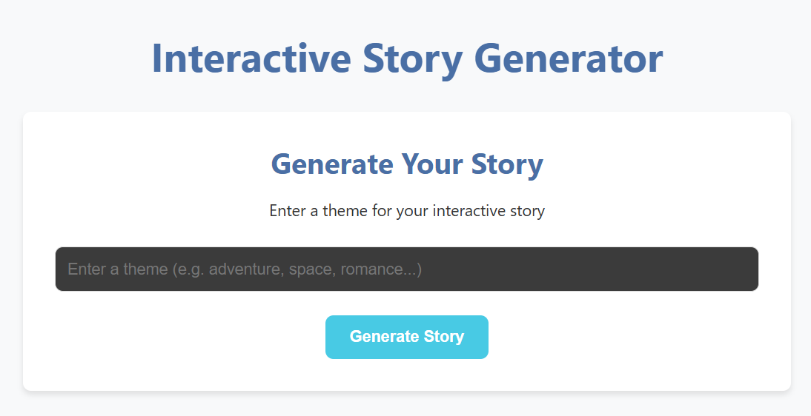
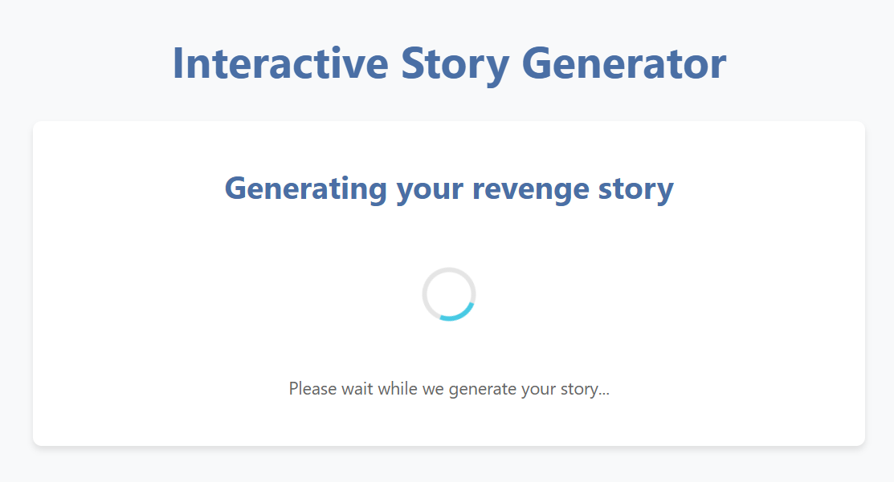
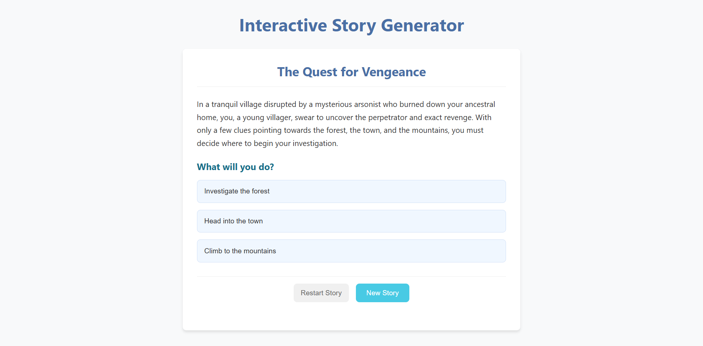
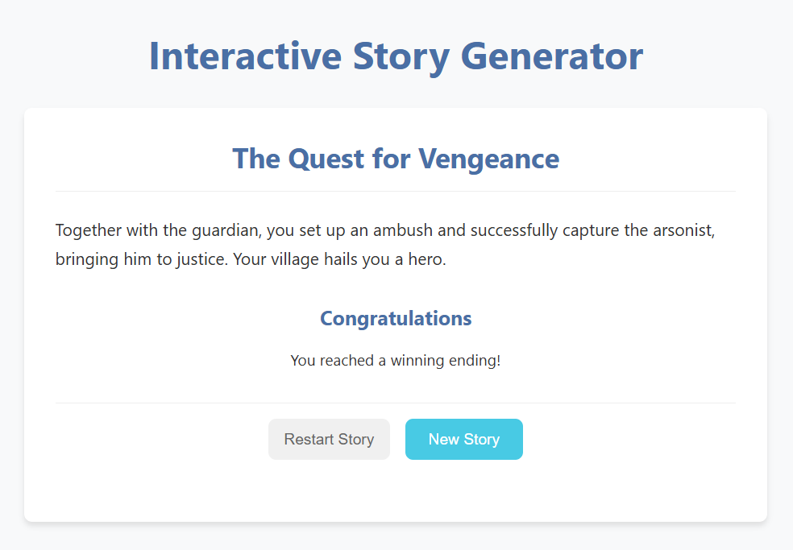

# Choose Your Own Adventure

**Choose Your Own Adventure** is a dynamic web application that generates interactive, branching stories based on a theme provided by the user. Users can navigate through the story by making choices at key decision points, leading to multiple paths and unique endings — some victorious, others... not so much.

## 🌟 Features

- 🧠 AI-generated, theme-based stories
- 🗺️ Branching narrative structure with multiple endings
- ⏱️ Asynchronous story generation using job polling
- 💾 Persistent storage for previously generated stories
- 📚 Replayable stories with rich choices

## 🛠 Tech Stack

- **Frontend**: React
- **Backend**: FastAPI
- **Database**: SQLite

## 📦 Project Structure

- `frontend/` – React-based user interface for generating and navigating stories
- `backend/` – FastAPI server that handles story generation, job status, and storage

## 🚀 Getting Started

### Backend Setup (FastAPI)

1. Navigate to the backend folder:
   ```bash
   cd backend
   ```
2. Create and activate a virtual environment:
   ```bash
   python -m venv venv
   source venv/bin/activate  # On Windows use `venv\Scripts\activate`
   ```
3. Install dependencies:

   ```bash
   pip install -r requirements.txt
   ```

4. Run the server:

### Frontend Setup (React)

1. Navigate to the frontend folder:
   ```bash
   cd frontend
   ```
2. Install dependencies:
   ```bash
   npm install
   ```
3. Start the development server:
   ```bash
   npm start
   ```

## 🖼️ Screenshots

### 1. Home Page

Users can enter a theme to generate a new story.



### 2. Story Loading

The frontend shows a loading state while waiting for the story to generate.



### 3. Story With Choices

Once the story is ready, users can read and choose different actions to shape the story.



### 4. Story Outcome

Different choices lead to unique endings!


